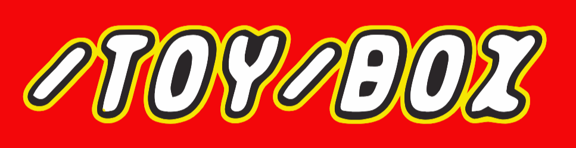

    

Collection of toy programs or otherwise interesting computational apparatus I've developed.

## 3D Renderer [🔗](3D%20Renderer)

A simple 3D renderer made in Rust.

## Bad Apple Font [🔗](Bad%20Apple%20Font)

Bad Apple played on a font.

## data_irl [🔗](data_irl)

Data visualization shenanigans.

## Minecraft Tic-Tac-Toe [🔗](Minecraft%20Tic-Tac-Toe)

A Minecraft (1.12.2) version of the Tic-Tac-Toe game made with [ComputerCraft](https://www.computercraft.info/) and [Chisel & Bits](https://www.curseforge.com/minecraft/mc-mods/chisels-bits).

## Raspberry Pi Clock [🔗](Raspberry%20Pi%20Clock)

A clock widget made with Tkinter. Its purpose was to be displayed on a Raspberry Pi with a LCD screen.

## String Art Generator [🔗](String%20Art%20Generator)

A simple string art generator made with [SMFL](https://www.sfml-dev.org/).
