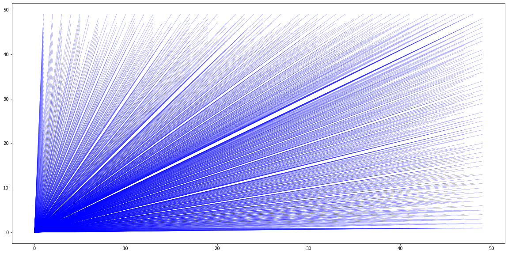
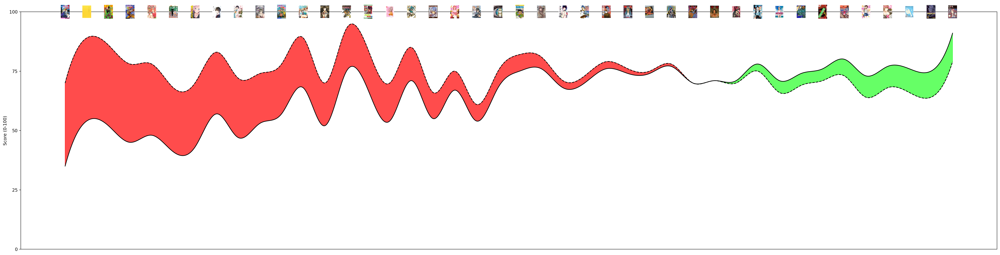

# data_irl

## Orchard 

A visualization of the orchard problem. Inspired by this [video](https://www.youtube.com/watch?v=p-xa-3V5KO8).

## Statistics 

Some visualizations of personal collected data I found interesting to do.

### Saved albums year distribution

A bar plot showing the release year distribution of my 133 saved albums on Spotify.

### Difference between mean score and personal score for anime

A line plot showing the difference between my personal score on a given anime I've watched and its mean score, calculated by averaging the scores of all AniList ratings.

